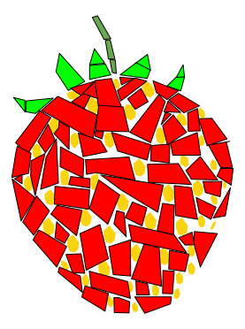
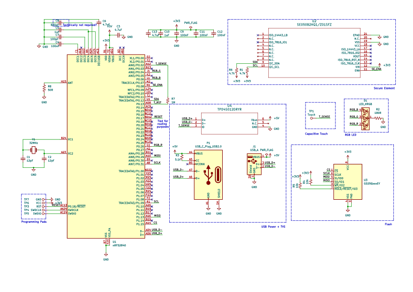
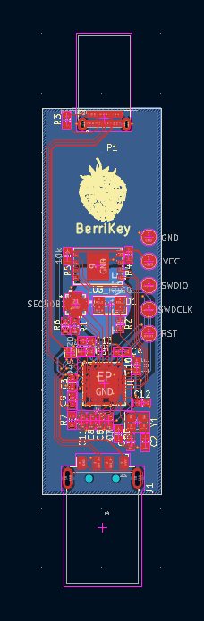
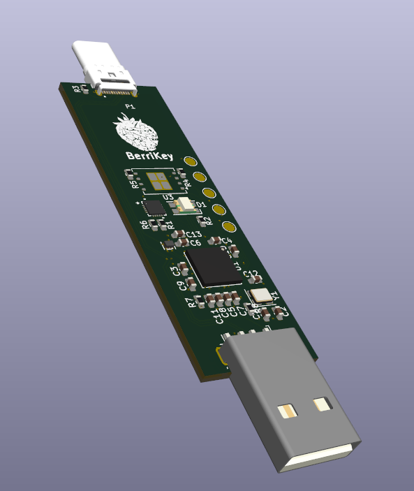
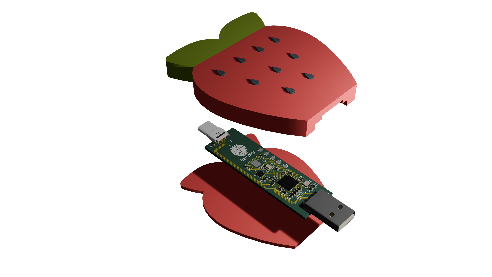

# BerriKey

---

**A strawberry-themed, hardware key backed by a tamper-proof Secure Element. Built on top of the FIDO2 protocol. Simply plug it in to any site or app that supports the protocol and register a secure authenticator**

## Features

- **nRF52840** microcontroller
- **SE050**, EAL 6+ certified, tamper proof secure element storage for key storage and cryptography
- **USB-C and USB-A** connectivity
- **Capacitive touch pad** for user verification
- **Strawberry shaped case**

## Why?

I wanted to make an actually secure, open source hardware key that I could use for my accounts. Current options like [Yubikeys](https://www.yubico.com/products/) were great but not open-sourced, and community projects like [PicoKey](https://www.picokeys.com/) did not use tamper-resistant storages, and relied on a [chip with known vulnerabilites to it's security features](https://www.raspberrypi.com/news/security-through-transparency-rp2350-hacking-challenge-results-are-in/). I wanted to make it uniquely mine, so I made it strawberry themed!

### Threat model

The purpose of the project was to create a secure key to protected online identity (avoiding use of passwords, which can be keylogged, over-the-shoulder'ed, or leaked)

The main goals were to address the following:

- adversaries: should defend against well funded actors with lab equipment and knowledge (not state actors with supreme funding), evil maid attacks (semi-brief physical attacks)
- attack surface: all crypto operations are performed on SE, only USB (no nfc / ble).
- trust boundaries: SE is ultimate crypto trust, with all operations on the chip. firmware is trusted out of necessity

Most importantly, keys should never be cloneable off device, which would lead to compromise of online identity without knowledge. This mitigates the biggest risk of stealing the key, where the user is expected to assume that it is lost forever and immediately revoke the keys.

## Credits

Credit goes to the [Nitrokey Team](https://github.com/Nitrokey/nitrokey-3-firmware) for creating open-source keys, which this firmware is based on. Rather then reinviting a FIDO2 stack, I forked it off the battle-tested Nitrokey3 that has undergone security audits - ensuring its security against my threat model. It has been modified to support both a USB-C and USB-A, add support to custom LEDs, capacitive touch pads and easier support for programming with the nRF52840 chip. GHowever, the hardware is custom, with a unique form factor.

## Design

### Wiring

### PCB

### Case

## Building & Running

5 SWD pads have been exposed on the PCB. Wire them to a CMSIS-DAP debugger (I tested using the RPI debuprobe). Go into `firmware/utils/nrf-builder` and run `make full-deploy`. This will flash the bootloader, provision the keys and certificates, and then flash the firmware.

## Zine

Check it out [here](./zine.pdf)!
